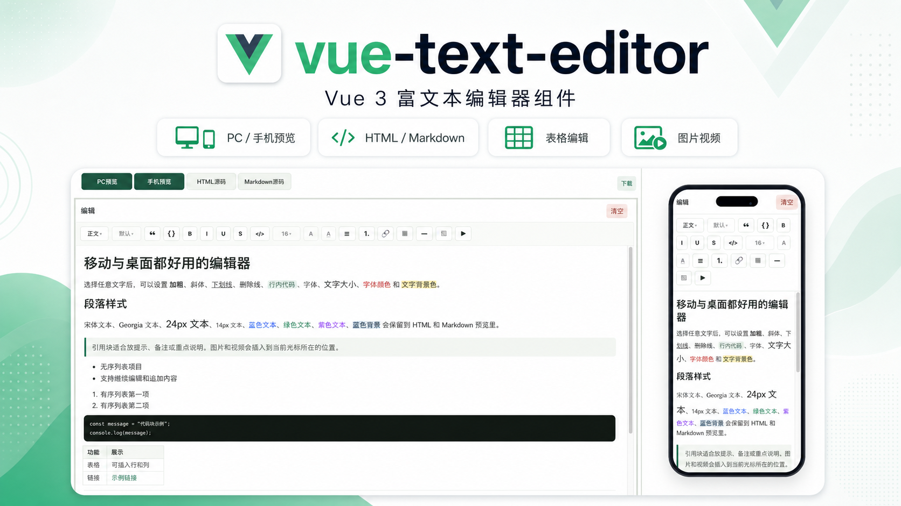

# vue-text-editor




一个面向 Vue 3 的富文本编辑器组件，适合封装成三方包给业务项目复用。组件输出安全清理后的 HTML，并提供 HTML、Markdown、完整 HTML 文档之间的转换工具。\

## 警告：不要直接使用 功能还在完善中 随时有破坏性修改

## 当前已实现

- 富文本编辑：正文、H1-H6、引用、代码块、加粗、斜体、下划线、删除线、行内代码、字体、字号、颜色和背景色。
- 内容输出：支持清理后的 HTML 输出、Markdown 输出，以及完整 HTML 文档导出。
- Markdown 兼容：标题、段落、引用、代码块、无序列表、有序列表、表格、链接、图片、分割线。
- 表格支持：支持表格插入，并可在表格内继续编辑。
- 媒体插入：支持图片和视频链接插入，也支持本地选择文件后转成 `data:` 或通过开发者上传接口转成 URL。
- HTML 粘贴：粘贴带标签内容时自动转换成编辑器支持的结构，尽量保留语义与样式。
- 工具栏配置：开发者可以指定开放哪些工具，不传时默认开放全部工具。
- 实例方法：支持聚焦、清空、获取内容、设置内容、插入 HTML、插入图片、插入视频。

## 后续规划

这些能力在设计文档里有规划，后续会继续补进来。下面内容是路线图，不代表当前版本已经完整支持：

- 更完整的移动端交互优化。
- 更细的表格编辑能力，例如删除行列、表头配置、对齐和单元格操作。
- 更完善的媒体上传工作流，例如上传进度、上传前校验、失败重试和统一错误提示。
- 更完整的内容块级编辑和预览布局，例如块列表、块选择、拖拽排序和块级删除。
- 更丰富的导出与复制场景，例如一键复制 HTML、Markdown、完整 HTML 文档。
- 更完整的历史记录能力，例如撤销、重做和批量操作回滚。

## 设计与实现说明

当前实现重点是“可直接在业务中使用的富文本编辑器”，而不是块编辑器或完整的内容管理工作台。
README 里的功能描述会优先以现有代码为准，规划中的能力只放在“后续规划”中，避免把未完成内容写成已完成。

## 安装

```bash
npm install vue-text-editor
```

组件依赖 Vue 3，Vue 作为 `peerDependency`，业务项目需要自行安装 Vue。

## 基础使用

```vue
<script setup>
import { ref } from 'vue';
import { RichTextEditor } from 'vue-text-editor';
import 'vue-text-editor/style.css';

const html = ref('<p>正文内容</p>');
</script>

<template>
  <RichTextEditor v-model="html" min-height="420px" />
</template>
```

## 全局注册

```js
import { createApp } from 'vue';
import VueTextEditor from 'vue-text-editor';
import 'vue-text-editor/style.css';
import App from './App.vue';

createApp(App)
  .use(VueTextEditor)
  .mount('#app');
```

注册后可直接使用：

```vue
<RichTextEditor v-model="html" />
```

## Props

| 属性 | 类型 | 默认值 | 说明 |
| --- | --- | --- | --- |
| `modelValue` | `string` | `''` | 编辑器 HTML 内容，支持 `v-model`。 |
| `initialValue` | `string` | `'<p><br></p>'` | `modelValue` 为空时的初始内容。 |
| `minHeight` | `string` | `'580px'` | 编辑区最小高度。 |
| `label` | `string` | `'编辑'` | 左上角标题。 |
| `clearable` | `boolean` | `true` | 是否显示清空按钮。 |
| `enabledTools` | `string[] \| null` | `null` | 工具栏白名单。不传或空数组时开放全部工具。 |
| `imageMode` | `'data' \| 'url'` | `'data'` | 用户选择本地图片后的处理方式。 |
| `uploadImage` | `(file: File) => string \| { url: string } \| Promise<string \| { url: string }>` | `null` | `imageMode="url"` 时必须传入，用于上传图片并返回 URL。 |
| `videoMode` | `'data' \| 'url'` | `'data'` | 用户选择本地视频后的处理方式。 |
| `uploadVideo` | `(file: File) => string \| { url: string } \| Promise<string \| { url: string }>` | `null` | `videoMode="url"` 时必须传入，用于上传视频并返回 URL。 |
| `placeholder` | `string` | `''` | 编辑区域为空时的占位文字。 |
| `readonly` | `boolean` | `false` | 只读模式，不允许编辑内容。 |
| `disabled` | `boolean` | `false` | 禁用模式，不允许编辑内容。 |

## enabledTools 可选值

```js
[
  'heading',
  'blockquote',
  'codeBlock',
  'bold',
  'italic',
  'underline',
  'strike',
  'inlineCode',
  'fontFamily',
  'fontSize',
  'textColor',
  'backgroundColor',
  'unorderedList',
  'orderedList',
  'table',
  'link',
  'divider',
  'image',
  'video'
]
```

兼容旧写法：`list` 会同时开启 `unorderedList` 和 `orderedList`。

| 工具值 | 说明 |
| --- | --- |
| `heading` | 标题/正文切换，支持 H1-H6。 |
| `blockquote` | 引用块。 |
| `codeBlock` | 代码块。 |
| `bold` | 加粗。 |
| `italic` | 斜体。 |
| `underline` | 下划线。 |
| `strike` | 删除线。 |
| `inlineCode` | 行内代码。 |
| `fontFamily` | 字体选择。 |
| `fontSize` | 字号选择。 |
| `textColor` | 字体颜色。 |
| `backgroundColor` | 文字背景色。 |
| `unorderedList` | 无序列表。 |
| `orderedList` | 有序列表。 |
| `list` | 兼容旧写法，同时开启无序和有序列表。 |
| `table` | 插入表格。 |
| `link` | 插入链接。 |
| `divider` | 插入分割线。 |
| `image` | 插入图片。 |
| `video` | 插入视频。 |

只开放部分能力：

```vue
<RichTextEditor
  v-model="html"
  :enabled-tools="[
    'heading',
    'bold',
    'italic',
    'fontFamily',
    'fontSize',
    'textColor',
    'unorderedList',
    'orderedList',
    'link',
    'image',
    'video'
  ]"
/>
```

如果需要禁用编辑但保留内容展示，可以使用 `readonly` 或 `disabled`：

```vue
<RichTextEditor v-model="html" readonly />
```

## 事件

| 事件 | 参数 | 说明 |
| --- | --- | --- |
| `update:modelValue` | `html: string` | 内容变化时触发，配合 `v-model`。 |
| `change` | `html: string` | 内容变化时触发，参数为清理后的 HTML。 |
| `focus` | `FocusEvent` | 编辑区获得焦点。 |
| `blur` | `FocusEvent` | 编辑区失去焦点。 |
| `image-upload-start` | `file: File` | 开始处理本地图片。 |
| `image-upload-end` | `{ file, src }` | 图片处理成功，`src` 为最终插入地址。 |
| `image-upload-error` | `{ file, error }` | 图片处理失败。 |
| `video-upload-start` | `file: File` | 开始处理本地视频。 |
| `video-upload-end` | `{ file, src }` | 视频处理成功，`src` 为最终插入地址。 |
| `video-upload-error` | `{ file, error }` | 视频处理失败。 |

## 实例方法

可以通过 `ref` 调用组件暴露的方法：

```vue
<script setup>
import { ref } from 'vue';
import { RichTextEditor } from 'vue-text-editor';

const editorRef = ref(null);

function insertWarning() {
  editorRef.value?.insertHtml('<blockquote>注意事项</blockquote>');
}
</script>

<template>
  <RichTextEditor ref="editorRef" v-model="html" />
  <button type="button" @click="insertWarning">插入提示</button>
</template>
```

| 方法 | 参数 | 返回值 | 说明 |
| --- | --- | --- | --- |
| `focus()` | 无 | `void` | 聚焦编辑区。 |
| `clear()` | 无 | `void` | 清空内容并恢复为空段落。 |
| `getHtml()` | 无 | `string` | 获取当前 HTML。 |
| `getMarkdown()` | 无 | `string` | 获取当前 Markdown。 |
| `setHtml(html)` | `string` | `void` | 设置编辑器 HTML，内部会清理不支持内容。 |
| `insertHtml(html)` | `string` | `void` | 在当前光标位置插入 HTML。 |
| `insertImage(src, alt?)` | `string, string?` | `void` | 在当前光标位置插入图片。 |
| `insertVideo(src)` | `string` | `void` | 在当前光标位置插入视频。 |

## 图片插入

图片按钮有两个入口：

- 图片链接：用户输入图片 URL，组件直接插入该 URL。
- 选择图片：用户选择本地图片，由开发者指定插入 `data:` 或上传后插入 URL。

使用 `data:`：

```vue
<RichTextEditor v-model="html" image-mode="data" />
```

上传到后台后使用 URL：

```vue
<script setup>
async function uploadImage(file) {
  const formData = new FormData();
  formData.append('file', file);

  const response = await fetch('/api/upload', {
    method: 'POST',
    body: formData
  });
  const result = await response.json();

  return result.url;
}
</script>

<template>
  <RichTextEditor
    v-model="html"
    image-mode="url"
    :upload-image="uploadImage"
  />
</template>
```

`uploadImage` 可以返回 URL 字符串，也可以返回 `{ url: string }`。

当 `image-mode="data"` 时，组件会把本地图片读成 `data:` 地址后插入内容，适合 demo、草稿、本地预览等场景。
当 `image-mode="url"` 时，必须传入 `uploadImage`，由业务方负责上传文件并返回最终 URL，适合生产环境。

## 视频插入

视频按钮和图片按钮一样，有两个入口：

- 视频链接：用户输入视频 URL，组件直接插入该 URL。
- 选择视频：用户选择本地视频，由开发者指定插入 `data:` 或上传后插入 URL。

使用 `data:`：

```vue
<RichTextEditor v-model="html" video-mode="data" />
```

上传到后台后使用 URL：

```vue
<script setup>
async function uploadVideo(file) {
  const formData = new FormData();
  formData.append('file', file);

  const response = await fetch('/api/upload-video', {
    method: 'POST',
    body: formData
  });
  const result = await response.json();

  return result.url;
}
</script>

<template>
  <RichTextEditor
    v-model="html"
    video-mode="url"
    :upload-video="uploadVideo"
  />
</template>
```

`uploadVideo` 可以返回 URL 字符串，也可以返回 `{ url: string }`。视频导出的 Markdown 会保留为 HTML `<video>` 标签，因为标准 Markdown 没有统一的视频语法。

当 `video-mode="data"` 时，组件会把本地视频读成 `data:` 地址后插入内容。视频文件通常较大，生产环境更推荐使用 `video-mode="url"` 并上传到业务文件服务。

## 表格编辑

工具栏中的表格按钮会插入一个基础表格。光标位于表格内部时，组件会显示表格操作区，当前支持追加行和追加列。

```vue
<RichTextEditor
  v-model="html"
  :enabled-tools="['table', 'bold', 'italic']"
/>
```

当前表格能力适合普通内容录入和展示。合并单元格、删除行列、列宽拖拽、表头配置等能力还在后续规划中。

## 粘贴与清理

组件会在写入内容时调用清理逻辑，只保留编辑器支持的标签和必要属性。粘贴 HTML 时会尽量保留常用语义，例如标题、段落、引用、列表、表格、链接、图片、视频和行内样式。

```js
import { sanitizeEditorHtml, taggedTextToEditorHtml } from 'vue-text-editor';

const cleanHtml = sanitizeEditorHtml(rawHtml);
const editorHtml = taggedTextToEditorHtml(fullHtmlDocument);
```

`sanitizeEditorHtml` 不是完整的 XSS 防护库。如果内容会被跨用户展示，服务端仍应按业务安全策略再次清理。

## HTML 与 Markdown

```js
import {
  editorHtmlToMarkdown,
  markdownToEditorHtml,
  sanitizeEditorHtml,
  taggedTextToEditorHtml,
  wrapHtmlDocument
} from 'vue-text-editor';
```

| 函数 | 说明 |
| --- | --- |
| `sanitizeEditorHtml(html)` | 清理 HTML，仅保留编辑器支持的标签和安全属性。 |
| `taggedTextToEditorHtml(text)` | 把带标签文本或完整 HTML 文档转换成编辑器 HTML；不能识别时返回 `null`。 |
| `markdownToEditorHtml(markdown)` | Markdown 转编辑器 HTML。 |
| `editorHtmlToMarkdown(html)` | 编辑器 HTML 转 Markdown。 |
| `wrapHtmlDocument(html)` | 生成带内联样式的完整 HTML 文档，可直接下载或复制到其他浏览器打开。 |

示例：

```js
const markdown = editorHtmlToMarkdown(html.value);
html.value = markdownToEditorHtml(markdown);

const documentHtml = wrapHtmlDocument(html.value);
```

完整 HTML 文档导出适合“下载为 HTML 文件”或“复制到独立页面预览”的场景。Markdown 转换覆盖常用内容结构，不追求完整 CommonMark 兼容。

## 样式定制

组件样式使用 `rv-editor` 前缀，降低污染宿主项目的风险。可以通过 CSS 变量调整基础主题：

```css
.my-editor {
  --rv-editor-accent: #0f766e;
  --rv-editor-text: #111827;
  --rv-editor-border: #d1d5db;
  --rv-editor-toolbar-bg: #f9fafb;
}
```

```vue
<RichTextEditor class="my-editor" v-model="html" />
```

如果需要完全接管样式，可以不引入 `vue-text-editor/style.css`，自行针对 `.rv-editor`、`.rv-editor__toolbar`、`.rv-editor__content` 等类编写样式。

## 打包与本地验证

开发示例：

```bash
npm run dev
```

构建示例页面：

```bash
npm run build
```

示例页面输出到 `demo-dist`，不会覆盖三方包产物。

构建三方包产物：

```bash
npm run build:lib
```

产物包括：

- `dist/vue-text-editor.es.js`
- `dist/vue-text-editor.umd.js`
- `dist/vue-text-editor.css`
- `dist/index.d.ts`

运行测试：

```bash
npm test -- --run
```

## 当前边界

- 组件基于浏览器 `contenteditable` 与 `document.execCommand`，适合中轻量富文本编辑场景。
- HTML 清理是白名单策略，只保留组件支持的标签和 `img src/alt`、`a href` 等必要属性。
- Markdown 转换覆盖常用写法，不追求完整 CommonMark 规范。
- 复杂表格合并单元格、图片拖拽缩放、协同编辑、历史撤销栈等能力不在当前组件范围内。
